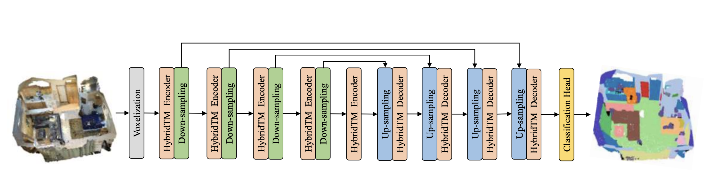
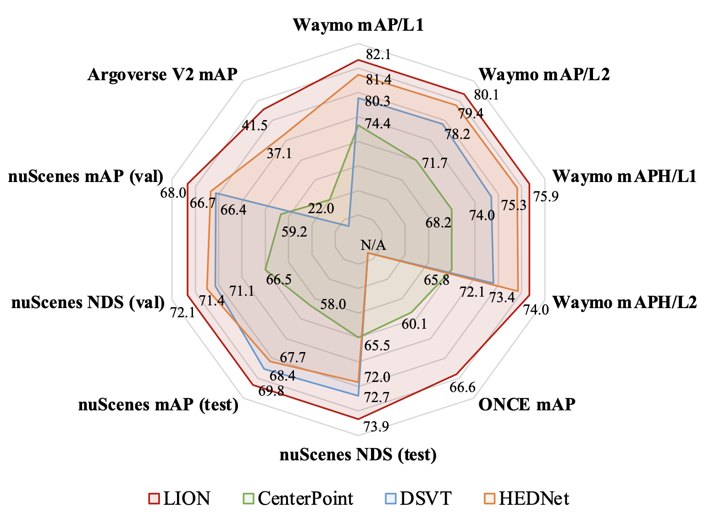
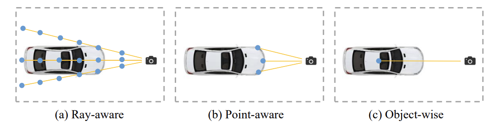
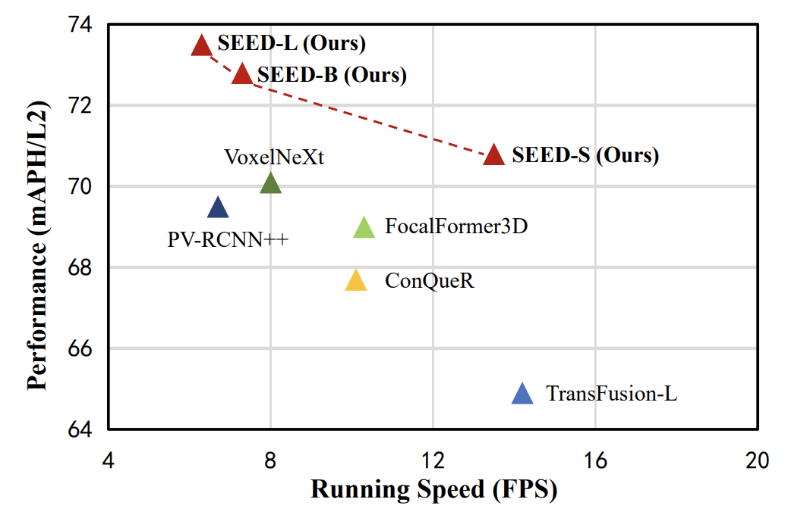
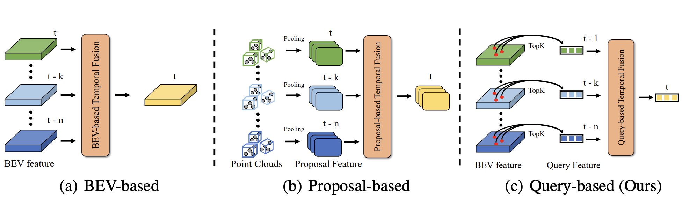

# Jinghua Hou

PhD Student, The University of Hong Kong
Research: 3D/4D Vision · Robotics · Spatial Intelligence

- [Google Scholar](https://scholar.google.com/citations?user=aoqtBAsAAAAJ&hl=en)
- [GitHub](https://github.com/AlmoonYsl)

## About Me

Hi, I am a first-year PhD student at The University of Hong Kong, fortunately supervised by Prof. Hengshuang Zhao. I received my Bachelor's and Master's degree from Huazhong University of Science and Technology (HUST) in 2022 and 2025. My current research focuses on Spatial Intelligence, World Model, and Embodied AI. My goal is to build intelligent robots capable of understanding and interacting with the physical world.

## News

- **[2026]** Two papers (**FASTER**, **StreamPI**) accepted to **NeurIPS 2026**.
- **[2025]** **HybridTM** accepted to **IROS 2025**.
- **[2024]** **LION** accepted to **NeurIPS 2024**.
- **[2024]** Two papers (**SEED**, **OPEN**) accepted to **ECCV 2024**.
- **[2023]** **QTNet** accepted to **NeurIPS 2023**.

## Selected Publications

(* indicates equal contribution)

- 
  **[StreamPI: Streaming Multimodal Temporal Modeling for Vision-Language-Action Models](https://arxiv.org/abs/2608.26067)**
  *NeurIPS 2026*
  Zhe Liu\*, **Jinghua Hou**\*, Yuxiang Lu, Zhenya Yang, Xianzhe Fan, Junyu Luo, Junyi Li, Ruihua Han, Zhi Hou, Hengshuang Zhao
  [Paper](https://arxiv.org/abs/2608.26067) [Page](https://happinesslz.github.io/projects/StreamPI/) [Code](https://github.com/hku-sail/StreamPI)

- 
  **[HybridTM: Combining Transformer and Mamba for 3D Semantic Segmentation](https://arxiv.org/pdf/2507.18575)**
  *IROS 2025*
  Xiaoshuai Wang\*, **Jinghua Hou**\*, Zhe Liu, Yingying Zhu
  [Paper](https://arxiv.org/pdf/2507.18575) [Code](https://github.com/deepinact/HybridTM)

- 
  **[LION: Linear Group RNN for 3D Object Detection in Point Clouds](https://arxiv.org/abs/2407.18232)**
  *NeurIPS 2024*
  Zhe Liu\*, **Jinghua Hou**\*, Xingyu Wang\*, Xiaoqing Ye, Jingdong Wang, Hengshuang Zhao, Xiang Bai
  [Paper](https://arxiv.org/abs/2407.18232) [Page](https://happinesslz.github.io/projects/LION/) [Code](https://github.com/happinesslz/LION)

- 
  **[OPEN: Object-wise Position Embedding for Multi-view 3D Object Detection](https://arxiv.org/abs/2407.10753)**
  *ECCV 2024*
  **Jinghua Hou**, Tong Wang, Xiaoqing Ye, Zhe Liu, Shi Gong, Xiao Tan, Errui Ding, Jingdong Wang, Xiang Bai
  [Paper](https://arxiv.org/abs/2407.10753) [Code](https://github.com/AlmoonYsl/OPEN)

- 
  **[SEED: A Simple and Effective 3D DETR in Point Clouds](https://arxiv.org/abs/2407.10749)**
  *ECCV 2024*
  Zhe Liu\*, **Jinghua Hou**\*, Xiaoqing Ye, Tong Wang, Jingdong Wang, Xiang Bai
  [Paper](https://arxiv.org/abs/2407.10749) [Code](https://github.com/happinesslz/SEED)

- 
  **[Query-based Temporal Fusion with Explicit Motion for 3D Object Detection](https://openreview.net/pdf?id=gySmwdmVDF)**
  *NeurIPS 2023*
  **Jinghua Hou**, Zhe Liu, Zhiying Zou, Xiaoqing Ye, Xiang Bai
  [Paper](https://openreview.net/pdf?id=gySmwdmVDF) [Code](https://github.com/AlmoonYsl/QTNet)

For the full publication list, please refer to my [Google Scholar](https://scholar.google.com/citations?user=aoqtBAsAAAAJ&hl=en) page.
